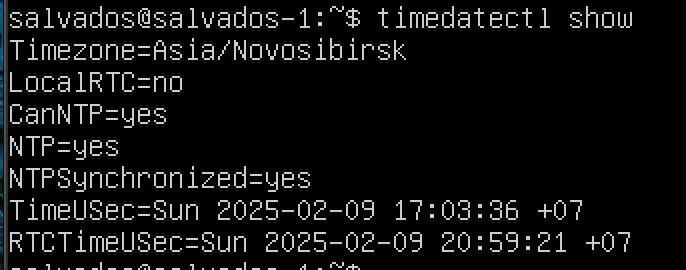
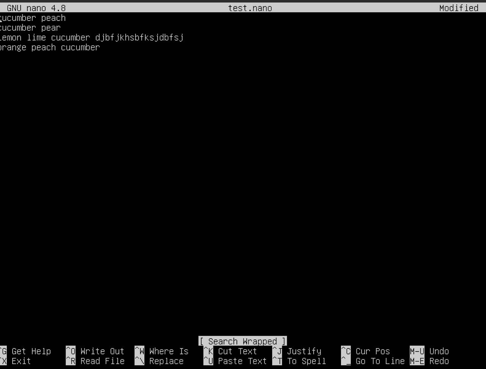
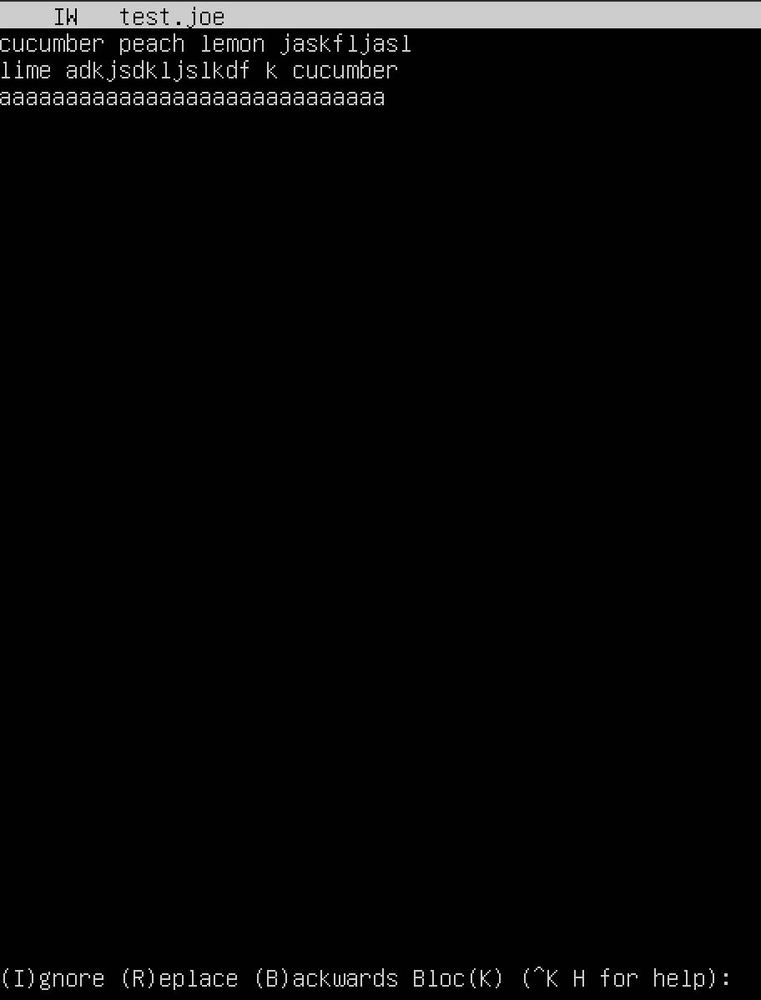
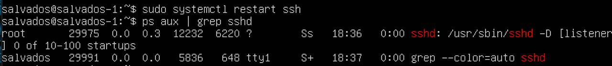

## Part 1

(вывод версии OC)

## Part 2

#### 2.1

(создание нового пользователя)

#### 2.2

(вывод команды cat /etc/passwd)

## Part 3

(смена имени хоста на имя вида user-1)

#### 3.2

(устанавливаем временную зону соответствующую текущему местоположению.)

#### 3.3

(вывод названия сетевых интерфейсов)

Интерфейс lo используется для связи внутри системы и позволяет программам, работающим на одном и том же устройстве, обмениваться данными друг с другом без необходимости использования физической сети. Он обеспечивает локальную связь и тестирование без необходимости использования внешних сетевых ресурсов.

#### 3.4

(получаю ip адрес устройства, на котором я работаю от DHCP-сервера)
DHCP расшифровывается как Dynamic Host Configuration Protocol.

#### 3.5

(внутренний ip-адресс шлюза)

(внешний ip-адресс шлюза)

#### 3.6

(открытие файла конфигурации сети)

(заданные статичные сетевые настройки)

#### 3.7

Перезагрузил систему, заданные настройки остались прежними

(пинг удаленных хостов)

(1.1.1.1)
(ya.ru)

## Part 4

(сообщение о том что обновления отсутствуют)

## Part 5

Команда sudo используется для выполнения команд от имени суперпользователя. Это дает возможность выполнять задачи, требующие более высоких прав доступа, чем у обычного пользователя.

(новый hostname и команда для его изменения)

## Part 6

#### 6.1

(вывод времени)

#### 6.2

(вывод команды timedatectl show)

## Part 7

#### 7.1.1

(содержимое файла перед закрытием в vim)

Для того чтобы выйти из редактора с сохранением изменений нужно нажать esc для выхода из режима вставки, ввести :wq и нажать enter.

#### 7.1.2

(содержимое файла перед закрытием в nano)

Для того чтобы выйти из редактора с сохранением изменений нужно нажать Ctrl + X и ввести Y.

#### 7.1.3

(содержимое файла перед закрытием в joe)

Чтобы выйти из joe с сохранением изменений нужно нажать (Ctrl + K) -> X.

#### 7.2.1

(содержимое файла после редактирования в vim)

Чтобы выйти без сохранения изменений из vim нужно нажать esc, чтобы выйти из режима редактирования, а затем :q! -> Enter.

#### 7.2.2

(содержимое файла после редактирования в nano)

Чтобы выйти из nano без сохранения изменений нужно нажать (Ctrl + X) -> N.

#### 7.2.3

(содержимое файла после редактирования в joe)

Чтобы выйти без сохранения изменений нужно нажать Ctrl + C и ввести y.

#### 7.3.1

(поиск слова cucumber в vim)

(замена слова cucumber в vim)

#### 7.3.2

(поиск слова cucumber в nano)

(замена слова cucumber на apple в nano. Команда для замены: Ctrl + /)

#### 7.3.3

(поиск слова cucumber в joe)

(замена слова cucumber на apple в joe. Команда для замены: \<cucumber\> Enter r Enter apple Enter r Enter)

## Part 8

#### 8.1

(Установлена служба SSHd)

#### 8.2

(добавлен автостарт службы при загрузке системы)

#### 8.3

Открыл файл командой: sudo nano /etc/ssh/sshd_config, в строке с параметром Port убрал знак решетки и поставил значение 2022, сохранил изменения и вышел. 

Выполнил перезапуск службы SSHd командой sudo systemctl restart ssh.

#### 8.4

(c помощью команды ps aux | grep sshd показано наличие процесса sshd)

ps это команда для отображения информации о текущих процессах.

aux: это комбинация ключей, которая указывает, какие процессы показывать.

|: это оператор канала, который передает вывод одной команды (в данном случае ps aux) в качестве ввода для другой команды (в данном случае grep sshd).

grep sshd: это команда для поиска строк, содержащих "sshd" в выводе предыдущей команды. Она фильтрует результаты так, что вы видите только процессы, связанные с SSHd.

#### 8.5

(Вывод команды netstat -tan)

• Ключи -tan:

     • -t: отображает только TCP-соединения.

     • -a: показывает все соединения и слушающие порты.

     • -n: выводит адреса и номера портов в числовом формате, без попытки разрешения имен.

• Столбцы вывода:

     1. Proto: Протокол.

     2. Recv-Q: Количество байтов, ожидающих обработки в очереди приема.

     3. Send-Q: Количество байтов, ожидающих отправки в очереди передачи.

     4. Local Address: Локальный адрес и порт.

     5. Foreign Address: Удаленный адрес и порт.

     6. State: Состояние соединения.

• Значение 0.0.0.0:

     • Это специальный адрес, который обозначает "все доступные интерфейсы".

## Part 9

#### 9.1

Вывод команды top:

• uptime: 5:17

• количество авторизованных пользователей: 1 user

• средняя загрузка системы: 0.00, 0.00, 0.00

• общее количество процессов: 200 total

• загрузка CPU: 0.0 us 0.3 sy 0.0 ni 99.7 id 0.0 wa 0.0 hi 0.0 si 0.0 st

• загрузка памяти: 1972.8 total 690.9 free 198.0 used 1083.9 buff/cache

• pid процесса занимающего больше всего памяти: 1

• pid процесса, занимающего больше всего процессорного времени: 186

#### 9.2.1

(вывод команды htop отсортированному по PID)

#### 9.2.2

(вывод команды htop отсортированному по PERCENT_CPU)

#### 9.2.3

(вывод команды htop отсортированному по PERCENT_MEM)

#### 9.2.4

(вывод команды htop отсортированному по TIME)

#### 9.2.5

(с процессом syslong)

## Part 10

• Название жесткого диска: /dev/sda

• Размер жесткого диска: 25 GB

• Количество секторов: 52428800

## Part 11

#### 11.1

Запустил команду df:

• размер раздела: 24541264

• размер занятого пространства: 4889356

• размер свободного пространства: 18370048

• процент использования: 22%

• единица измерения: КБ

#### 11.2

Запустил команду df -Th

• размер раздела: 24G

• размер занятого пространства: 4.7G

• размер свободного пространства: 18G

• процент использования: 22%

• тип файловой системы для раздела: ext4

## Part 12

#### 12.1

(вывод размера папок)

#### 12.2

(вывод размера всего содержимого в /var/log)

## Part 13

#### 13.1

(с помощью утилиты ncdu вывел размер папки /home)

#### 13.2

(с помощью утилиты ncdu вывел размер папки /var)

#### 13.3

(с помощью утилиты ncdu вывел размер папки /var/log)

## Part 14

#### 14.1

• время последней успешной авторизации: Feb 9 20:54:01

• имя пользователя: user2

• метод входа в систему: пользователь вошел в систему через физическую консоль. Session opened for root by salvados(uid=0)

#### 14.2

(сообщение о рестарте службы)

## Part 15

#### 15.1

(строчки о выполнении в системном журнале)

#### 15.2

(список текущих заданий для CRON)

#### 15.3

(список текущих заданий для CRON)

